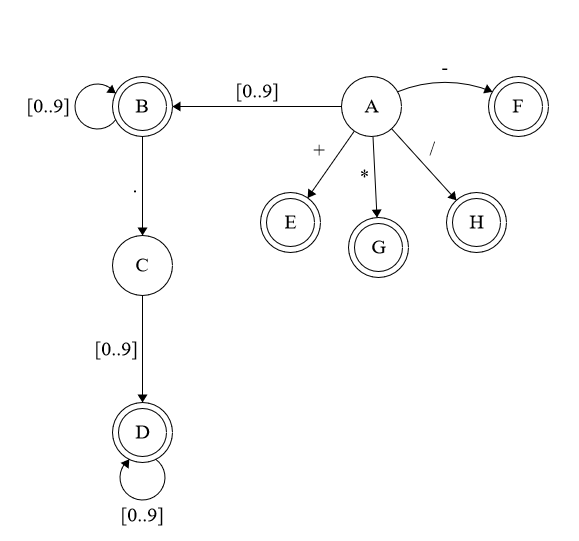

  Atividade 4
======
1.  Implementação de um léxico para operações aritméticas utilizando as duas abordagens dadas em sala de aula.
Seguindo o seguinte autômato:




### C++
```cpp

Token Lexer::getToken(char c){
    token_.lexeme = "";
    token_.line = -1;
    switch (c)
    {
        //SOMA | SUB
        case '+':
        case '-':
        token_.lexeme = c;
        token_.line = line_;
        token_.classification = TokenType::AddOp;
        break;

        //MULT | DIV
        case '*':
        case '/':
        token_.lexeme = c;
        token_.line = line_;
        token_.classification = TokenType::MultOp;
         
        break;

    
    default:
        //REAL NUMBER | INTEGER
        if(std::isdigit(c)){
            token_.lexeme = c;
            token_.lexeme = readNumber(token_.lexeme); //já classifica em real ou inteiro
            token_.line = line_;
        } else if(std::isspace(c)) {
            ;//pula
        } else {
            token_.lexeme = c;
            lexerError("Símbolo não pertence à linguagem!");
        }

        break;
    }
    
    return token_;

}

std::string Lexer::readNumber(std::string currentLexeme){
    std::string lexeme = currentLexeme;
    char c;
    file_.get(c);

    while(isdigit(c)){
        lexeme+=c;
        file_.get(c);

        if(file_.eof())
            return lexeme;

    }
    
    if(c == '.'){
        lexeme+=c;
        token_.classification = TokenType::RealNumber;
    } else
    {
        token_.classification = TokenType::IntNumber;
        file_.unget();
        return lexeme;
    }

    while(isdigit(c)){
        lexeme+=c;
        file_.get(c);

         if(file_.eof())
            return lexeme;

    }


    file_.unget();
    return lexeme;
}
```

### FLEX

```C
DIGITO[0-9]
OPERADOR[\ | * | + | -]

%%
{DIGITO}+  { 
  printf("Número inteiro%s\n", yytext); 
}
{DIGITO}+"."{DIGITO}* {
  printf("Número real %s\n", yytext);
}
{OPERADOR} {
  printf("Operador %s\n", yytext);
}
%%

int main(void) {
  yylex();

  return 0;
}
```
